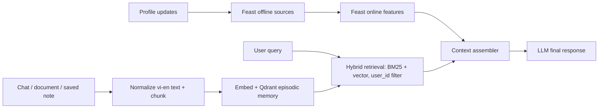

# Hybrid Memory Assistant cho người dùng Việt Nam

## Mục tiêu và data flow

POC này là một trợ lý cá nhân tiếng Việt: nó nhớ điều người dùng đã đọc hoặc ghi chú, nhưng không nhầm những mẩu hội thoại ngắn hạn đó với hồ sơ ổn định. Episodic memory được lưu bằng vector và metadata trong Qdrant; profile ổn định và activity gần đây được phục vụ qua Feast. LLM không nằm trong POC, nhưng nhận context đã lắp ghép để sinh câu trả lời cuối.

Lúc `remember()`, POC chunk note, embed rồi upsert vector kèm `user_id`. Lúc `recall()`, filter `user_id` được đưa vào Qdrant, kết quả dense và lexical được RRF với rank bắt đầu từ 1, sau đó ghép với `topic_affinity`, `preferred_language`, `reading_speed_wpm` và `queries_last_hour` từ Feast. Như vậy model có thể trả lời bằng ký ức cụ thể nhưng vẫn điều chỉnh cách trình bày theo profile.

## Quyết định 1 — chunk episodic memory

Tôi chọn chunk theo ngữ nghĩa nhẹ: tối đa khoảng 320 ký tự, overlap 48 ký tự, ưu tiên giữ nguyên từ và câu thay vì cắt byte. Lựa chọn thay thế là một vector cho cả conversation hoặc một vector per-message. Per-conversation rẻ hơn về số vector, nhưng khi một cuộc trò chuyện có cả Kubernetes, chi phí cloud và đời sống cá nhân, recall kéo lên quá nhiều context không liên quan. Per-message làm retrieval rất chính xác cho câu ngắn nhưng tăng số vector, mất liên kết giữa câu hỏi và câu trả lời, đồng thời tạo nhiều bản ghi 1–5 từ khó embed.

Chunk 320/48 là điểm cân bằng giữa retrieval quality, chi phí storage và context window: một note kỹ thuật Việt/Anh thường giữ được một ý trọn vẹn, overlap bảo vệ cụm như “autoscaling theo lưu lượng”, còn top-3 không nhanh chóng làm đầy prompt. Đổi lại, nó có thể cắt một đoạn dài ở vị trí chưa hoàn hảo; production nên dùng sentence boundary + semantic splitter và đo recall trên note thật.

Với tiếng Việt, whitespace có ích nhưng không đủ: từ ghép có thể viết tách, người dùng hay code-switch “scale out”, “deployment”, “cost optimization”, hoặc gõ thiếu dấu. Vì vậy ingestion giữ raw text, thêm normalized/no-diacritic field cho BM25 và chọn multilingual embedding. POC dùng bge-small để chạy nhẹ, nhưng launch thật sẽ đổi sang bge-m3 và re-index toàn bộ memories.

## Quyết định 2 — schema profile

Tôi chọn tabular Feature Views cho `preferred_language`, `topic_affinity`, `reading_speed_wpm` (entity `user_id`, TTL 30 ngày) và `queries_last_hour` (entity `user_id`, TTL 1 giờ). Nguồn profile là onboarding và aggregate hành vi; activity là streaming/event aggregate. Schema này dễ point-in-time join, audit và phục vụ dưới 10 ms. Profile không cập nhật mỗi query nên 30 ngày tránh dữ liệu biến mất vô ích; velocity phải hết hạn sau 1 giờ để không gọi một sở thích tuần trước là “gần đây”.

Tôi đã cân nhắc embedding preference làm feature duy nhất. Embedding có thể bắt preference latent tốt hơn, nhưng khó giải thích, khó debug training-serving skew, tốn re-embedding khi model đổi và không hợp với TTL/schema governance. Vì sản phẩm đầu tiên cần controllable personalization, tôi giữ tabular features trước; embedding preference chỉ là candidate re-ranker sau khi có evaluation. Đây cũng là lý do episodic memory không được nhét vào feature store: cycle của memory là phút/giờ, còn profile là ngày/tuần, và vector retrieval có nhu cầu top-K khác hoàn toàn online feature lookup.

## Quyết định 3 — freshness theo use case

Tôi không dùng một SLA freshness cho mọi dữ liệu. Khi user vừa lưu một note và hỏi “trợ lý nhớ gì về tôi?”, Qdrant phải visible dưới một giây bằng synchronous upsert; nếu không, hành vi trông như mất dữ liệu. Với recommendation sau khi đọc tài liệu, aggregate activity có thể micro-batch 5 phút: trải nghiệm vẫn mới nhưng giảm writes và chi phí streaming. Với profile lâu dài như language hay reading speed, daily batch là đủ và giảm noise. Lựa chọn thay thế “stream tất cả sub-second” có latency tốt nhất nhưng vận hành Kafka/online aggregation phức tạp và không tạo giá trị cho feature đổi chậm.

## Privacy, giới hạn và bước tiếp theo

`user_id` payload filter là ranh giới bảo mật bắt buộc; không filter sẽ lặp lại tenant leak của NB7. Production cần authorization trước Qdrant, encryption at rest, delete/retention theo consent và Decree 13, không chỉ tin vào filter do app truyền vào. POC chưa xử lý CRUD memory, multi-device sync, typo normalization đầy đủ, per-user key encryption, reranking hay LLM safety. Những thiếu sót này có chủ ý: demo tối ưu clarity của separation vector/feature store, chưa tuyên bố là personal-data production system.
